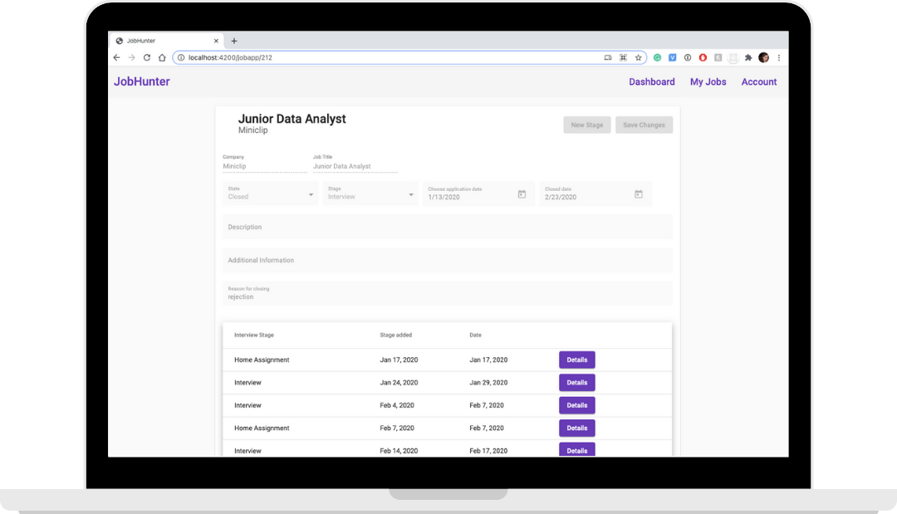

# JobHunter

JobHunter is a tool to track your job applications. Keep all information about jobs and interviews in one place!

## Screenshots

<p align="center">
  
  
</p>

## Getting started

Install and run Postgres, create JobHunter database. Run queries to create tables: 
```
CREATE TABLE jobapp (
    id integer DEFAULT nextval('"JobApp_id_seq"'::regclass) PRIMARY KEY,
    position character varying(100) NOT NULL,
    company character varying(50) NOT NULL,
    description text,
    state character varying(50) NOT NULL DEFAULT 'Passive'::character varying,
    stage character varying(50) NOT NULL DEFAULT 'Applied'::character varying,
    source character varying(50),
    addinfo text,
    closedreason text,
    createdat text NOT NULL DEFAULT ''::text,
    appliedat text NOT NULL DEFAULT ''::text,
    closedat text DEFAULT ''::text
);
CREATE TABLE jobstage (
    id integer DEFAULT nextval('"JobStage_id_seq"'::regclass) PRIMARY KEY,
    createdat text NOT NULL,
    type character varying(50) NOT NULL,
    date text,
    addinfo text,
    jobappid integer NOT NULL DEFAULT nextval('"JobStage_jobappid_seq"'::regclass) REFERENCES jobapp(id) ON DELETE CASCADE
);

```

## Installation

1. Clone this repo and enter!

   ```bash
   git clone https://github.com/marlukyanova/jobhunter.git
   cd jobhunter
   ```

2. Install dependencies for server.

   ```bash
   cd server
   npm install
   npm i koa koa-bodyparser koa-router @koa/cors pg
   npm start
   ```

3. Install dependencies for client.
   
   ```bash
   cd client
   npm install
   npm install -g @angular/cli
   npm install d3
   ng add @angular/material
   ng serve --open
   ```
   
Install Angular Material with following settings: 
- prebuilt theme name: deeppurple-amber.css
- global Angular Material typography styles: yes
- BrowserAnimationModules: no


## Tech Stack

* [Angular](https://angular.io/)
* [Angular Material](https://material.angular.io/)
* [D3](https://d3js.org/)
* [Koa](https://koajs.com/)
* [Postgres](https://www.postgresql.org/)

## Further improvements

Next steps:
- Refactor to use Sequelize
- Authentication
- Improve dashboard

## Author

Maria Lukyanova - [GitHub](https://github.com/marlukyanova) - [LinkedIn](www.linkedin.com/in/marlukyanova)
